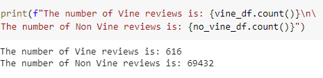
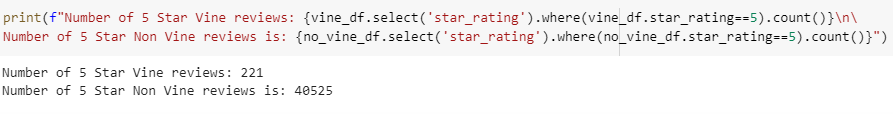
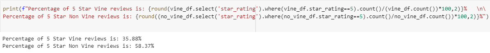

# Amazon_Vine_Analysis

## Analysis Overview
The focus of this project was to analyze Amazon reviews written by members of the paid Amazon Vine program. I used Pyspark to perform an ETL process to extract, transform, connect to an AWS RDS instance and load the transformed data into pgAdmin. I then used Pyspark to determine the bias towards favorable reviews from Vine members in my dataset. The dataset I chose was the one based off beauty sales.

## Resources
* Data source:
  * [Amazon Review Datasets](https://s3.amazonaws.com/amazon-reviews-pds/tsv/index.txt)
  * [Amazon Beauty Review Dataset](https://s3.amazonaws.com/amazon-reviews-pds/tsv/amazon_reviews_us_Beauty_v1_00.tsv.gz)

* Software:
  * Google Colab
  * pgAdmin4
  * AWS

## Outcome

### Number of Vine and non-Vine reviews

### How many 5 star reviews there were from both Vine and non-Vine members

### Percentage of 5 star reviews from both Vine users and non-Vine members

## Summary
In each review summary, you can see that the numbers of non-Vine reviews outweigh the number of Vine reviews. This shows that the positive feedback given on these beauty products are favorable by organic reach as well as paid reach.
